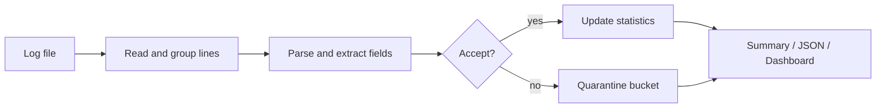
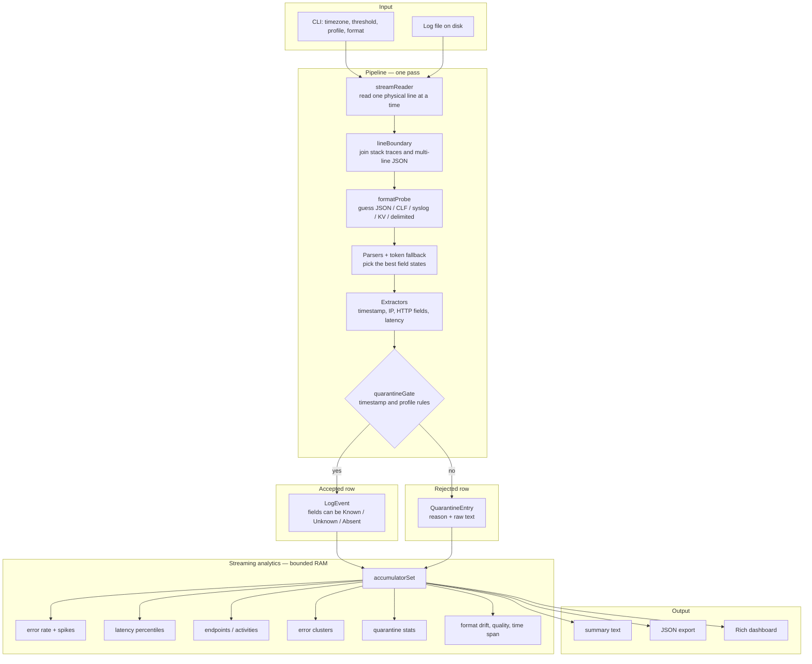

# Architecture

logana is built around one simple rule: read one file once, keep memory bounded, and turn each line into something useful if I can.

## What Problem It Solves

logana is **not** a log search platform like Splunk or the Elastic stack. Those systems index many hosts and support interactive search at scale. logana solves a narrower problem: **one file, one sequential pass, bounded memory**, with immediate summary statistics.

| Idea                                                 | How it appears in logana                                                                             |
| ---------------------------------------------------- | ---------------------------------------------------------------------------------------------------- |
| Read the file once, like ops often do                | Streaming pipeline: read → group lines → parse → accept or quarantine → update metrics → print       |
| Common web server access log format                  | Dedicated parser for Combined Log Format (CLF) plus shared HTTP field extraction                     |
| Syslog and `key=value` lines                         | Syslog and logfmt-style parsers; timezone and missing-year handling for older logs                   |
| JSON log lines, including multi-line JSON            | JSON parser plus line grouping so stack traces stay with the record they belong to                   |
| Percentiles without storing every sample             | T-Digest ([Dunning, 2013](https://github.com/tdunning/t-digest)) for approximate p50/p95/p99 latency |
| Spike detection relative to this file                | Median Absolute Deviation (MAD) on error-rate buckets, not a fixed global threshold                  |
| Do not discard a whole line because one field failed | Each field is **Known**, **Absent**, or **Unknown**, with a confidence score                         |
| Show why a line was skipped                          | Quarantine entries store a human-readable reason, not silent drops                                   |

The point is not to perfectly understand every log format. The point is to give useful answers quickly, while staying honest about uncertainty.

## Big Picture

The program reads a log file line by line, groups related lines together, tries to recognize the format, extracts standard fields, decides whether the record is trustworthy enough, and updates live metrics as it goes.

## Pipeline

The pipeline is intentionally streaming.

### Step by step

1. `streamReader` reads the file one physical line at a time.
2. `lineBoundary` joins lines that belong together, like stack traces or multi-line JSON.
3. `formatProbe` and `parserDispatch` guess the best parser and fall back to token scanning when needed.
4. `Extractors` and line-pattern helpers fill standard fields such as timestamp, IP, HTTP method, URL path, status code, latency, and log level.
5. `quarantineGate` decides whether a record is trustworthy enough to count. In the default pragmatic mode, the timestamp matters most; in strict mode, weaker optional fields can also reject a record.
6. `accumulatorSet` updates error rate, latency, endpoint counts, error clusters, and related metrics while staying within fixed memory caps.
7. Output renders the report as summary text, JSON, or the live dashboard.

## Code Layers

| Layer          | Responsibility                                                  |
| -------------- | --------------------------------------------------------------- |
| **CLI**        | Arguments, timezone, output format, quarantine profile          |
| **Pipeline**   | Streaming read, grouping, parser selection, quarantine          |
| **Parsers**    | JSON, CLF, syslog, key=value, delimited text                    |
| **Extractors** | Shared rules for timestamps, IP addresses, HTTP fields, latency |
| **Models**     | `LogEvent`, quarantine records, per-field state                 |
| **Analytics**  | Error rate, latency digest, endpoints, clusters, format drift   |
| **Output**     | Text summary, JSON export, Rich dashboard                       |

## Main Tradeoffs

The code chooses predictable behavior over guessing too much.

1. **Streaming over full-file loading** — memory stays bounded, but the code cannot do expensive global rewrites after the fact.
2. **Heuristics over hard schemas** — this works across many log styles, but unusual vendor formats may need aliases or CLI hints.
3. **Field-level uncertainty** — one weak token does not ruin the whole record, but some records still end up quarantined when the timestamp is not trustworthy.
4. **Bounded analytics** — endpoint tables, cluster lists, and digests have caps so the tool stays fast, but the tool may group rare items into `(other)`.
5. **Live dashboard support** — the dashboard is convenient for exploration, but it depends on `rich` and a normal terminal.

## Memory Limits

These are approximate working limits, chosen to keep the tool stable on large files.

| Structure                                   | Limit                                  |
| ------------------------------------------- | -------------------------------------- |
| Lines merged into one logical record        | 50                                     |
| Context snippets kept for quarantined lines | 5 × 200 characters                     |
| Distinct endpoint paths tracked             | 200 (extra paths grouped as `(other)`) |
| Error pattern clusters                      | 50                                     |
| Latency digest centroids                    | ~100                                   |
| Error-rate history buckets                  | 60                                     |

The file on disk may be much larger; the in-memory working set should not keep growing with file size.

## Known Limitations

- One file at a time, not a multi-host log platform.
- Text logs only; binary formats such as EVTX or PCAP are out of scope.
- Heuristic parsing means some unusual vendor formats may need `--log-timezone` or `--reference-date`.
- Stack trace tails sometimes quarantine separately from the error header; the header is still useful for error metrics.
- Dashboard mode requires `rich`; otherwise the tool falls back to plain summary output.
