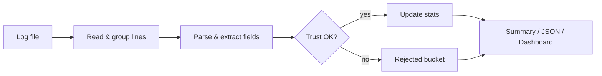
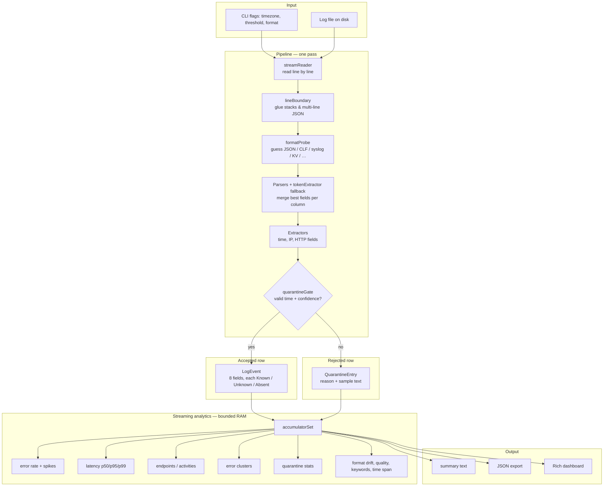
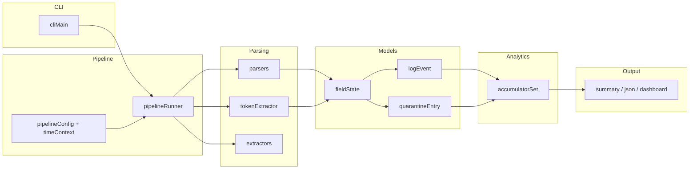

# logana

**A streaming log analyzer for messy real-world files.**

Point it at one log file. It reads the file line by line (it does **not** load the whole file into memory), figures out mixed formats on the fly, and prints error rates, latency percentiles, top endpoints, error clusters, and quarantine reasons.

**Design diagrams:** [Architecture](#architecture) (end-to-end flow + layers). Renders on GitHub; or paste the Mermaid blocks into [mermaid.live](https://mermaid.live) to export PNG.

---

## What you get

| Output | Best for |
|--------|----------|
| **summary** (default) | Plain-text report in the terminal |
| **json** | Scripts, CI, or saving `report.json` |
| **dashboard** | Live Rich terminal UI while the file is processed |

**Metrics include:** parse success vs quarantine rate, error rate over time (with spike detection), p50/p95/p99 latency, per-endpoint volume and errors, repeating error patterns (clustered), format drift when the log style changes mid-file, and field-level parse quality.

**Sample log:** `app.log` in the repo root (mixed Apache-style, JSON, syslog, and app lines — good for a first run).

**Grading / Q&A:** see **[ANSWERS.md](ANSWERS.md)** for stack choices, edge cases, and AI usage notes.

---

## Where the design came from

logana is **not** a mini Splunk or ELK. Those systems solve search at scale across many hosts. This project solves **one file, one pass, bounded RAM** closer to what you do with `grep`, `awk`, and `tail`, but with structure-aware parsing and rolling stats.

| Inspiration | How it shows up here |
|-------------|----------------------|
| **Ops habit: read the file once** | Streaming pipeline: read → group lines → parse → gate → update metrics → print. No database, no upload UI. |
| **Apache / nginx access logs (CLF)** | Dedicated CLF parser plus shared HTTP field extractors (method, path, status, response time). |
| **Syslog and key=value lines** | Syslog and logfmt-style parsers; timezone and “missing year” handling for older logs. |
| **JSON log lines (and multi-line JSON)** | JSON parser plus line grouping so stack traces and pretty-printed blobs stay one logical record. |
| **T-Digest** ([Dunning, 2013](https://github.com/tdunning/t-digest)) | Approximate p50/p95/p99 latency without storing every sample — memory stays flat on long files. |
| **Median Absolute Deviation (MAD)** | Error-rate spikes are judged against **this file’s** baseline, not a fixed global threshold. |
| **“Don’t throw away the whole line”** | Each field is **Known**, **Absent**, or **Unknown** with a confidence score — a bad latency token does not erase a good timestamp. |
| **Quarantine instead of silent drop** | Low-confidence or time-less rows are stored with a **reason** so you can see parser gaps, not just “missing data.” |

---

## Architecture

One file flows through a fixed pipeline. Analytics run **per event** as lines are processed, not after loading everything.

### Quick view



### Design diagram (end-to-end)



### Design diagram (layers)



```text
log file
  → streamReader          (read lines as a generator)
  → lineBoundary          (join multi-line JSON, stack traces)
  → parserDispatch        (guess format, run parser, merge fallback tokens)
  → quarantineGate        (confidence + valid time)
  → accumulatorSet        (bounded streaming metrics)
  → summary | json | dashboard
```

### Layers (by responsibility)

| Layer | Role |
|-------|------|
| **CLI** | Arguments, timezone, output format |
| **Pipeline** | Orchestration: streaming, grouping, gating |
| **Parsers** | JSON, CLF (Apache-style), syslog, key=value, delimited |
| **Extractors** | Shared rules for timestamp, IP, HTTP fields |
| **Models** | `LogEvent`, quarantine records, per-field certainty |
| **Analytics** | Error rate, latency digest, endpoints, clusters, drift |
| **Output** | Text summary, JSON export, Rich dashboard |

### Core design ideas

1. **Streaming first** — The file is a generator end to end. Metrics update as each logical record is accepted or quarantined.

2. **Uncertainty per field** — Fields carry confidence. Analytics can use what is solid and ignore what is not, instead of dropping the entire line.

3. **Quarantine with reasons** — Rows below the confidence threshold, or without a usable timestamp (unless you opt in), go to quarantine with an explicit reason. They still appear in quarantine stats.

4. **Bounded memory** — Caps on endpoint table size, error clusters, digest size, and context buffers keep RAM roughly **flat** as the file grows.

### Memory caps (approximate)

| Structure | Limit |
|-----------|--------|
| Lines per logical record | 50 |
| Context snippets kept | 5 × 200 characters |
| Distinct endpoint paths tracked | 200 (rest → `(other)`) |
| Error pattern clusters | 50 |
| Latency digest centroids | ~100 |
| Error-rate history buckets | 60 |

The log on disk can be gigabytes; working set should not grow with every line forever.

### Honest limits

- **One file, one machine** — not a log platform.
- **Text logs only** — no binary EVTX, PCAP, etc.
- **Heuristic parsers** — odd vendor formats may need `--log-timezone` or `--reference-date`.
- **Stack trace tails** — continuation lines (`at com.example...`) often quarantine separately from the error header; metrics on the error are still useful, but quarantine % can look high.
- **Dashboard** needs a real terminal and the `rich` package; otherwise the tool falls back to summary text.

---

## Requirements

- **Python 3.11 or newer**
- **[Poetry](https://python-poetry.org/docs/#installation)** for install and runs (recommended)
- **Windows / macOS / Linux** — tested with Poetry; CLI handles consoles that lack Unicode glyphs

**Libraries** (installed via Poetry): `click`, `rich`, `tzdata`, `python-dateutil`, `drain3`, `orjson`, `logfmt`, `apachelogs`, `pydantic`, `plotext`. T-Digest percentiles use the in-tree implementation (the PyPI `tdigest` package needs a C++ toolchain on Windows).

---

## Install and run

### 1. Clone and enter the project

```bash
git clone https://github.com/emanalytic/Logana
cd Log-Analyzer
```

### 2. Install with Poetry

```bash
poetry lock
poetry install
```

### 3. Run on the sample log

```bash
poetry run logana app.log --log-timezone Asia/Karachi

poetry run logana app.log --log-timezone Asia/Karachi --format dashboard

```

> **Tip:** If timestamps in your file are “local wall clock” in a specific region, set `--log-timezone` to that IANA name (e.g. `America/Chicago`, `Asia/Karachi`, `UTC`, or `local`).

---

## CLI reference

```text
poetry run logana [OPTIONS] FILE_PATH
```

| Option | Default | What it does |
|--------|---------|----------------|
| `FILE_PATH` | *(required)* | Path to a **file** (not a folder). Must exist and be readable. |
| `--format` | `summary` | `summary`, `json`, or `dashboard` |
| `--quarantine-threshold` | `0.3` | Minimum parse confidence (0.0–1.0) to accept a row |
| `--log-timezone` | `local` | IANA zone for **naive** timestamps (e.g. `America/Chicago`, `UTC`, `local`) |
| `--naive-timestamps` | `local` | Treat naive times as `local` wall time or `utc` |
| `--reference-date` | *(none)* | `YYYY-MM-DD` anchor when syslog lines have **no year** |
| `--encoding` | `utf-8` | File encoding: `utf-8`, `utf-8-sig`, `latin-1`, etc. |
| `--allow-synthetic-timestamps` | off | Last resort: assign weak “ingestion time” when no timestamp is found |
| `-h`, `--help` | | Show help |

### Commands you will use often

**Default text report**

```bash
poetry run logana app.log --log-timezone Asia/Karachi
```

**Live terminal dashboard**

```bash
poetry run logana app.log --log-timezone Asia/Karachi --format dashboard
```

**JSON for tooling**

```bash
poetry run logana app.log --log-timezone Asia/Karachi --format json > report.json
```

**Older syslog without a year** (example: Linux_2k fixture)

```bash
poetry run logana tests/fixtures/Linux_2k.log --reference-date 2004-06-15
```

**Stricter parsing** (fewer quarantines, more rejects)

```bash
poetry run logana app.log --quarantine-threshold 0.5
```

**Windows-legacy encoding**

```bash
poetry run logana app.log --encoding latin-1 --log-timezone local
```

**Help**

```bash
poetry run logana --help
```

### Test fixture examples

See `tests/fixtures/README.md` for what each file contains.

```bash
poetry run logana tests/fixtures/sample2.log --format dashboard
poetry run logana tests/fixtures/complex.log --log-timezone UTC
poetry run logana tests/fixtures/hdfs_sample.log
```

---

## Troubleshooting install and runs

### `poetry: command not found`

Install Poetry from the [official docs](https://python-poetry.org/docs/#installation), then open a **new** terminal and run `poetry --version`.

### `Python version ... is not supported`

You need **3.11+**. Check with:

```bash
python --version
```

Use pyenv, the Windows Store Python installer, or python.org to install 3.11 or 3.12, then point Poetry at it:

```bash
poetry env use python3.12
poetry install
```

### `ModuleNotFoundError: No module named 'logana'`

Usually the package was not installed in the Poetry venv.

```bash
cd Log-Analyzer
poetry install
poetry run logana --help
```

Always prefer **`poetry run logana`** over a global `logana` unless you explicitly activated the venv.

### `logana.cmd` / entry point looks wrong after pulling changes

Refresh the lockfile and reinstall:

```bash
poetry lock
poetry install
```

The console script is defined in `pyproject.toml` as `logana.cli.cliMain:main`.

### `FileNotFoundError` or path errors

- Use a **file** path, not a directory.
- On Windows, quote paths with spaces: `poetry run logana "C:\logs\app.log"`.

### Garbled characters or `UnicodeEncodeError`

Try:

```bash
poetry run logana app.log --encoding utf-8-sig
```

The CLI also replaces unprintable glyphs on limited Windows consoles when possible.

### Dashboard shows nothing useful

- Run in a real terminal (Windows Terminal, iTerm, etc.), not a stripped-down log pane.
- If `rich` is missing, you get **summary** fallback automatically.

### Everything quarantines — “no valid timestamp”

- Set **`--log-timezone`** to where the log was written.
- For syslog **without a year**, add **`--reference-date YYYY-MM-DD`**.
- Only if you understand the tradeoff: **`--allow-synthetic-timestamps`**.

### Error rate looks wrong on “WARN” lines

By design, a line can say WARN/INFO but still count as an error if the **HTTP status is 5xx** — that matches how ops often judges outages (see `errorSeverity` in code and **ANSWERS.md**).

---

## Development and tests

```bash
poetry install
poetry run pytest -q
```

With coverage:

```bash
poetry run pytest --cov=logana --cov-report=term-missing
```

Layout:

- **`src/logana/`** — application code  
- **`tests/`** — unit, integration, and fixture corpus tests  

---

## Project layout (high level)

```text
Log-Analyzer/
├── app.log              # sample mixed log
├── ANSWERS.md           # submission Q&A
├── pyproject.toml       # Poetry config and CLI entry point
├── src/logana/          # package (cli, pipeline, parsers, analytics, output)
└── tests/               # pytest suite and fixtures
```

---

