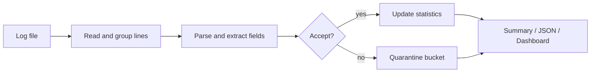
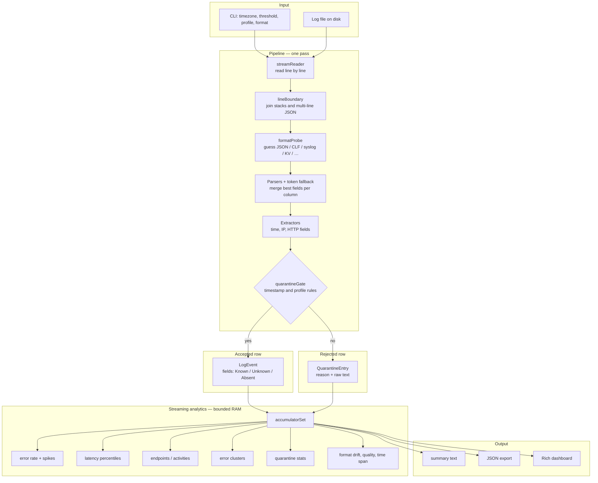

# logana

**A streaming log analyzer for a single text log file.**

You point logana at one file on disk. It reads the file line by line without loading the whole file into memory, groups related lines (for example stack traces or multi-line JSON), extracts structured fields where possible, and prints a report: how many lines were understood, how many were rejected, error rates over time, latency percentiles when response times are present, busy endpoints or activities, and grouped error messages.

This project is aimed at the same kind of task you might do with `grep`, `tail`, and `awk`, but with consistent field extraction and rolling statistics instead of ad-hoc one-off commands.

**Further reading:** [Architecture](#architecture) · [Evaluation on real logs](#evaluation-on-real-logs) · [ANSWERS.md](ANSWERS.md) (design choices, edge cases, grading notes)

---

## What you get

After processing a file, you can choose one of three output modes:

| Mode | Description |
|------|-------------|
| **summary** (default) | A readable text report in the terminal |
| **json** | Structured output for scripts, CI, or saving to `report.json` |
| **dashboard** | A live terminal UI (requires the `rich` library) while the file is still being read |

The report can include:

- **Parse outcomes** — how many logical records were accepted versus sent to quarantine (rejected with a reason)
- **Error rate** — share of accepted lines classified as errors, plus spike detection relative to the rest of the file
- **Latency** — approximate p50, p95, and p99 response times when the log contains duration or `time:` fields
- **Endpoints / activities** — which URL paths or message patterns appear most often
- **Error clusters** — similar error lines grouped so repeated failures are easier to see
- **Format drift** — when the dominant line shape changes partway through the file
- **Field quality** — how confidently timestamps, status codes, and other fields were parsed

A good first run on included data:

```bash
poetry run logana tests/fixtures/OpenStack_2k.log --log-timezone UTC --format dashboard
```

That OpenStack sample is a strong match for this tool: timestamps, HTTP-style paths, status codes, and over a thousand latency samples in one pass.

---

## Evaluation on real logs

All fixtures under `tests/fixtures/` are real samples from the public [LogHub](https://github.com/logpai/loghub) dataset (2,000 lines per system). They are used to measure how well logana generalizes—not as a list of files that each need their own parser.

Full results, per-file notes, and reproduction commands are in **[tests/fixtures/LOGHUB.md](tests/fixtures/LOGHUB.md)**.

Quick reproduction:

```bash
poetry run python scripts/benchmarkFixtures.py
poetry run pytest -q tests/integration/testLoghubCorpus.py
```

On the current codebase, OpenStack, Apache, Linux, OpenSSH, Hadoop, HDFS, and Zookeeper are **strong fits** (0% quarantine under default settings). Spark and Proxifier are **partial** fits (lines are accepted, but not every field or calendar year is trustworthy). HealthApp is **mixed** (~21% quarantine on lines without a parseable timestamp). See LOGHUB.md for the full table and what each label means.

---

## What problem this solves (and what it does not)

logana is **not** a log search platform like Splunk or the Elastic stack. Those systems index many hosts and support interactive search at scale. logana solves a narrower problem: **one file, one sequential pass, bounded memory**, with immediate summary statistics.

| Idea | How it appears in logana |
|------|---------------------------|
| Read the file once, like ops often do | Streaming pipeline: read → group lines → parse → accept or quarantine → update metrics → print |
| Common web server access log format | Dedicated parser for Combined Log Format (CLF) plus shared HTTP field extraction |
| Syslog and `key=value` lines | Syslog and logfmt-style parsers; timezone and missing-year handling for older logs |
| JSON log lines, including multi-line JSON | JSON parser plus line grouping so stack traces stay with the record they belong to |
| Percentiles without storing every sample | T-Digest ([Dunning, 2013](https://github.com/tdunning/t-digest)) for approximate p50/p95/p99 latency |
| Spike detection relative to this file | Median Absolute Deviation (MAD) on error-rate buckets, not a fixed global threshold |
| Do not discard a whole line because one field failed | Each field is **Known**, **Absent**, or **Unknown**, with a confidence score |
| Show why a line was skipped | Quarantine entries store a human-readable reason, not silent drops |

---

## Architecture

Processing is **streaming**: analytics update as each logical record is accepted or quarantined. Nothing waits until the entire file has been read into memory.

### End-to-end flow



### Detailed pipeline



### Walkthrough

1. **streamReader** reads the file as a generator, one physical line at a time.
2. **lineBoundary** merges lines that belong together (continuation of a stack trace, indented JSON, and similar cases).
3. **formatProbe** and **parserDispatch** guess the best parser (JSON, CLF, syslog, key=value, delimited) and fall back to a generic token scanner when no structured parser fits.
4. **Extractors** and **line patterns** fill standard columns: timestamp, IP, HTTP method, URL path, status code, response time in milliseconds, log level.
5. **quarantineGate** decides whether the record is trusted enough to count in metrics. Under the default **pragmatic** profile, only the timestamp must be solid; under **strict**, weak optional fields can also cause rejection.
6. **accumulatorSet** updates error rate, latency digest, endpoint counts, error clusters, and related statistics with fixed memory caps.
7. **Output** renders summary text, JSON, or the live dashboard.

```text
log file
  → streamReader
  → lineBoundary
  → parserDispatch (format probe + parsers + token fallback)
  → quarantineGate
  → accumulatorSet
  → summary | json | dashboard
```

### Code layers

| Layer | Responsibility |
|-------|----------------|
| **CLI** | Arguments, timezone, output format, quarantine profile |
| **Pipeline** | Orchestration: streaming read, grouping, gating |
| **Parsers** | JSON, CLF, syslog, key=value, delimited text |
| **Extractors** | Shared rules for timestamps, IP addresses, HTTP fields |
| **Models** | `LogEvent`, quarantine records, per-field state |
| **Analytics** | Error rate, latency digest, endpoints, clusters, format drift |
| **Output** | Text summary, JSON export, Rich dashboard |

### Design principles

1. **Streaming first** — Memory use should stay predictable as file size grows.
2. **Uncertainty per field** — A bad status code token does not erase a good timestamp; analytics use what is reliable.
3. **Quarantine with reasons** — Rejected lines are counted and explained, so gaps in parsing are visible in the report.
4. **Bounded memory** — Endpoint tables, cluster lists, digest size, and context buffers have caps (see table below).

### Memory limits (approximate)

| Structure | Limit |
|-----------|--------|
| Lines merged into one logical record | 50 |
| Context snippets kept for quarantined lines | 5 × 200 characters |
| Distinct endpoint paths tracked | 200 (additional paths grouped as `(other)`) |
| Error pattern clusters | 50 |
| Latency digest centroids | ~100 |
| Error-rate history buckets | 60 |

The file on disk may be very large; the working set in RAM should not grow without bound as line count increases.

### Known limitations

- **One file at a time** — not a multi-host log platform.
- **Text logs only** — binary formats (EVTX, PCAP, and similar) are out of scope.
- **Heuristic parsing** — unusual vendor formats may need `--log-timezone` or `--reference-date`.
- **Stack trace tails** — continuation lines sometimes quarantine separately from the error header; error metrics on the header line remain useful.
- **Dashboard** requires a normal terminal and the `rich` package; otherwise the tool prints the text summary instead.

---

## Requirements

- **Python 3.11 or newer**
- **[Poetry](https://python-poetry.org/docs/#installation)** (recommended for install and runs)
- **Windows, macOS, or Linux**

Main dependencies (via Poetry): `click`, `rich`, `tzdata`, `python-dateutil`, `drain3`, `orjson`, `logfmt`, `apachelogs`, `pydantic`. Latency percentiles use an in-tree T-Digest implementation because the PyPI `tdigest` package requires a C++ compiler on Windows.

---

## Install and run

### 1. Clone and enter the project

```bash
git clone https://github.com/emanalytic/Logana
cd Log-Analyzer
```

### 2. Install dependencies

```bash
poetry lock
poetry install
```

### 3. Run on a sample log

```bash
poetry run logana tests/fixtures/OpenStack_2k.log --log-timezone UTC
```

Live dashboard:

```bash
poetry run logana tests/fixtures/OpenStack_2k.log --log-timezone UTC --format dashboard
```

If timestamps in your file are local wall clock time in a specific region, set `--log-timezone` to the matching IANA name (for example `America/Chicago`, `Asia/Karachi`, `UTC`, or `local`).

---

## CLI reference

```text
poetry run logana [OPTIONS] FILE_PATH
```

| Option | Default | Meaning |
|--------|---------|---------|
| `FILE_PATH` | *(required)* | Path to a single log **file** (not a directory) |
| `--format` | `summary` | Output: `summary`, `json`, or `dashboard` |
| `--quarantine-threshold` | `0.3` | Minimum confidence (0.0–1.0) for fields that must pass under **strict** profile |
| `--profile` | `pragmatic` | `pragmatic` (require a good timestamp only), `strict` (also check optional fields), `forensics` (allow synthetic time when missing) |
| `--log-timezone` | `local` | IANA timezone for timestamps that have no offset (for example `UTC`, `America/Chicago`, `local`) |
| `--naive-timestamps` | `local` | Treat naive timestamps as local wall time or as UTC |
| `--reference-date` | *(none)* | Anchor date (`YYYY-MM-DD`) when syslog lines omit the year |
| `--encoding` | `utf-8` | File encoding: `utf-8`, `utf-8-sig`, `latin-1`, and others |
| `--allow-synthetic-timestamps` | off | Assign a weak ingestion timestamp when no time is found (also enabled by `--profile forensics`) |
| `-h`, `--help` | | Show help |

### Common examples

**Default text report**

```bash
poetry run logana tests/fixtures/OpenStack_2k.log --log-timezone UTC
```

**JSON for automation**

```bash
poetry run logana tests/fixtures/OpenStack_2k.log --log-timezone UTC --format json > report.json
```

**Syslog without a year** (Linux fixture)

```bash
poetry run logana tests/fixtures/Linux_2k.log --reference-date 2004-06-15
```

**Stricter acceptance** (optional fields must also be confident)

```bash
poetry run logana tests/fixtures/OpenSSH_2k.log --profile strict --log-timezone UTC
```

**Legacy Windows encoding**

```bash
poetry run logana tests/fixtures/Linux_2k.log --encoding latin-1 --reference-date 2004-06-15
```

**Benchmark all LogHub fixtures**

```bash
poetry run python scripts/benchmarkFixtures.py
```

See also `tests/fixtures/README.md` and **[tests/fixtures/LOGHUB.md](tests/fixtures/LOGHUB.md)**.

---

## Troubleshooting

### `poetry: command not found`

Install Poetry from the [official documentation](https://python-poetry.org/docs/#installation), open a new terminal, and run `poetry --version`.

### `Python version ... is not supported`

Python **3.11+** is required. Check with `python --version`, install a supported version if needed, then:

```bash
poetry env use python3.12
poetry install
```

### `ModuleNotFoundError: No module named 'logana'`

Install the package in the Poetry environment:

```bash
cd Log-Analyzer
poetry install
poetry run logana --help
```

Use **`poetry run logana`** unless you have explicitly activated the virtual environment.

### Entry point problems after pulling changes

```bash
poetry lock
poetry install
```

The console script is defined in `pyproject.toml` as `logana.cli.cliMain:main`.

### `FileNotFoundError` or path errors

- Pass a **file** path, not a directory.
- On Windows, quote paths with spaces: `poetry run logana "C:\logs\app.log"`.

### Garbled characters or `UnicodeEncodeError`

Try a different encoding:

```bash
poetry run logana tests/fixtures/Apache_2k.log --encoding utf-8-sig --reference-date 2005-12-04
```

The CLI replaces unprintable characters on limited Windows consoles when possible.

### Dashboard is empty or unhelpful

Run in a full terminal (Windows Terminal, iTerm, and similar). If `rich` is missing, logana falls back to the text summary automatically.

### Most lines are quarantined — “no valid timestamp”

- Set **`--log-timezone`** to the zone where the log was written.
- For syslog **without a year**, add **`--reference-date YYYY-MM-DD`** (or rely on automatic year detection from early lines).
- For exploratory acceptance only: **`--profile forensics`** or **`--allow-synthetic-timestamps`** (read the warnings in the output).

### Error rate seems high on WARN lines

A line can contain the word WARN and still count as an error if the HTTP status is 5xx. That matches how many teams judge outages from access logs. Details are in `errorSeverity` in the code and in **ANSWERS.md**.

---

## Development and tests

```bash
poetry install
poetry run pytest -q
```

With coverage:

```bash
poetry run pytest --cov=logana --cov-report=term-missing
```

| Path | Contents |
|------|----------|
| `src/logana/` | Application code |
| `tests/` | Unit tests, integration tests, LogHub fixtures |
| `tests/fixtures/LOGHUB.md` | Benchmark results and methodology |
| `scripts/benchmarkFixtures.py` | Run all fixture logs and print a comparison table |

---

## Project layout

```text
Log-Analyzer/
├── ANSWERS.md              # Submission Q&A and design notes
├── pyproject.toml          # Poetry config and CLI entry point
├── scripts/
│   └── benchmarkFixtures.py
├── src/logana/             # cli, pipeline, parsers, extractors, analytics, output
└── tests/fixtures/         # LogHub logs and LOGHUB.md results
```
